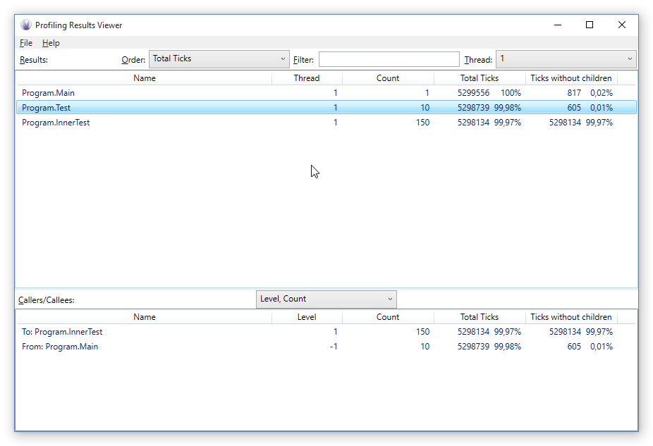

# RemObjects Instrumental Profiler Aspect

This repository holds the instrumental profiler aspect, library and viewer. All code here is licensed under the [MIT license](LICNSE.md).

How it works:
The profiling aspect adds pre/post conditions to every method that it's marked with. When the application finishes it writes a .log file next to the executable. This log file contains SQL statements to build a database with the profiling information. This can be loaded into for example SQLite, or in the ResultsViewer application. This code depends on the [Elements compiler](http://elementscompiler.com) to work.

## Using the profiler aspect
Compiler the SLN with any recent Elements install, reference both RemObjects.Profiler.dll and RemObjects.Profiler.Aspect.dll from your project and apply the aspect to the classes or methods you want to profile: 

* Oxygene: \[RemObjects.Profiler.Profile\]
* C#: \[RemObjects.Profiler.Profile\]
* Swift: @RemObjects.Profiler.Profile

On the project level, set the **PROFILE** define to make sure the profiler works, undefine this to remove any trace of the profiling code, while leaving in the aspects if needed.

Run the application, make sure to completion, then use the ResultsViewer application to view the results.

## Profiling Result Viewer

The results viewer is a simple program that loads & views the result of a profile session. The top list view contains the results. **Thread** the managed thread id of the thread that ran the code, **Count** the nubmer of times that method got called. **Total Ticks** is the time spent in these methods (shown as ticks and a % of the total time). **Ticks without children** shows how much time is actually spent in this method itself, ie excluding the calls it does, note that the exclusion only counts other calls also profiled.

The bottom view gets updated depending on the selected call. It shows who called this item and what it called. Positive level are calls that this function made, where level 1 is the method that gets directly called, level 2 is the method that gets called by a level 1 method. Negative levels show who called this method where -1 is a direct caller.

## Notes

* The profiler affects the code generated and makes it slower, also disabling inlining in most cases, the times should be seen compared to other methods, not as the absolute time a method takes.
* Mono and .NET can give vastly different results, if both are targetted it might be worth running the profiling on both.
* Instrumental profiling works best applies to only parts of the program, the parts that are of interest so to keep the list clear and clean and the overhead to a minimum; Property getter/setters are already ignored by the profiling aspect.
